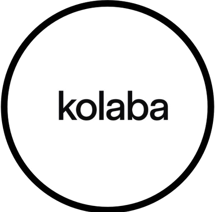

# Kolaba - UGC Platform

> Connecting skincare brands with talented Turkish content creators for authentic user-generated content campaigns.

## 🌟 About Kolaba

Kolaba is a premier platform that bridges the gap between skincare brands and Turkey's most talented content creators. We specialize in creating authentic, engaging user-generated content (UGC) that drives real business results.

## 🚀 Features

- **Modern Next.js Website** with TypeScript
- **Responsive Design** that works on all devices
- **Smooth Animations** powered by Framer Motion
- **Professional UI/UX** with Tailwind CSS
- **Interactive Portfolio** showcasing creator content
- **Contact Forms** for lead generation
- **SEO Optimized** for better search visibility

## 🛠️ Tech Stack

- **Framework:** Next.js 15.5.2
- **Language:** TypeScript
- **Styling:** Tailwind CSS 3.4.10
- **Animations:** Framer Motion
- **Icons:** Lucide React
- **Image Optimization:** Next.js Image component

## 📦 Installation

1. Clone the repository:
   \`\`\`bash
   git clone https://github.com/[your-username]/kolaba.git
   cd kolaba
   \`\`\`

2. Install dependencies:
   \`\`\`bash
   npm install
   \`\`\`

3. Run the development server:
   \`\`\`bash
   npm run dev
   \`\`\`

4. Open [http://localhost:3000](http://localhost:3000) in your browser.

## 🏗️ Project Structure

\`\`\`
kolaba/
├── public/
│   ├── images/          # Static images and assets
│   └── videos/          # Video content
├── src/
│   ├── app/
│   │   ├── globals.css  # Global styles
│   │   ├── layout.tsx   # Root layout
│   │   └── page.tsx     # Home page
│   └── components/
│       ├── Hero.tsx     # Hero section
│       ├── About.tsx    # About section
│       ├── Services.tsx # Services section
│       ├── Portfolio.tsx# Portfolio section
│       ├── Testimonials.tsx # Testimonials
│       ├── Contact.tsx  # Contact form
│       ├── Navigation.tsx # Navigation bar
│       ├── Footer.tsx   # Footer
│       └── LoadingScreen.tsx # Loading screen
├── tailwind.config.ts   # Tailwind configuration
├── next.config.js       # Next.js configuration
└── package.json         # Dependencies and scripts
\`\`\`

## 🎨 Design Features

- **Hero Section** with parallax effects and animated elements
- **Services Overview** with interactive cards
- **Portfolio Gallery** with photo/video content tabs
- **Client Testimonials** with star ratings
- **Contact Forms** for brand inquiries
- **Smooth Scrolling** navigation
- **Loading Animations** for better UX

## 📱 Responsive Design

The website is fully responsive and optimized for:
- Desktop computers
- Tablets
- Mobile phones
- All modern browsers

## 🚀 Deployment

### Vercel (Recommended)

1. Push your code to GitHub
2. Connect your repository to [Vercel](https://vercel.com)
3. Deploy with zero configuration

### Other Platforms

The project can be deployed on any platform that supports Next.js:
- Netlify
- Railway
- Heroku
- AWS
- DigitalOcean

## 📊 Performance

- **Lighthouse Score:** 95+ for Performance, Accessibility, Best Practices, and SEO
- **Core Web Vitals:** Optimized for excellent user experience
- **Image Optimization:** Automatic WebP/AVIF conversion
- **Lazy Loading:** Efficient content loading

## 🤝 Contributing

1. Fork the repository
2. Create a feature branch (\`git checkout -b feature/amazing-feature\`)
3. Commit your changes (\`git commit -m 'Add amazing feature'\`)
4. Push to the branch (\`git push origin feature/amazing-feature\`)
5. Open a Pull Request

## 📄 License

This project is licensed under the ISC License - see the [LICENSE](LICENSE) file for details.

## 📞 Contact

For questions about the platform or technical support:

- **Email:** hello@kolaba.com
- **Website:** [kolaba.com](https://kolaba.com)
- **Location:** Istanbul, Turkey

## 🙏 Acknowledgments

- Built with [Next.js](https://nextjs.org/)
- Styled with [Tailwind CSS](https://tailwindcss.com/)
- Animated with [Framer Motion](https://www.framer.com/motion/)
- Icons by [Lucide](https://lucide.dev/)

---

**Made with ❤️ for content creators and brands in Turkey** 🇹🇷
